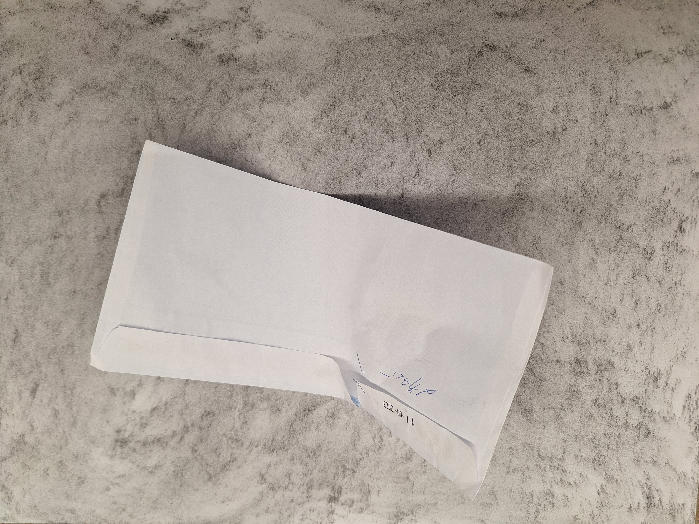
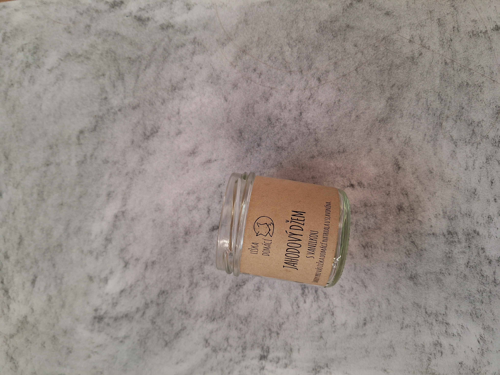
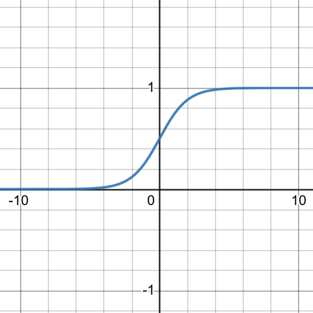
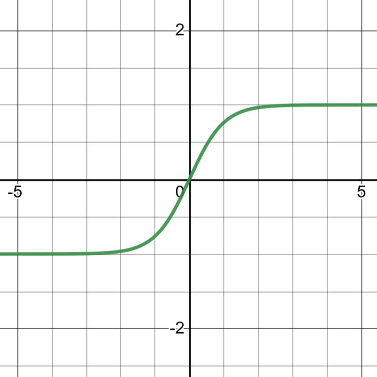
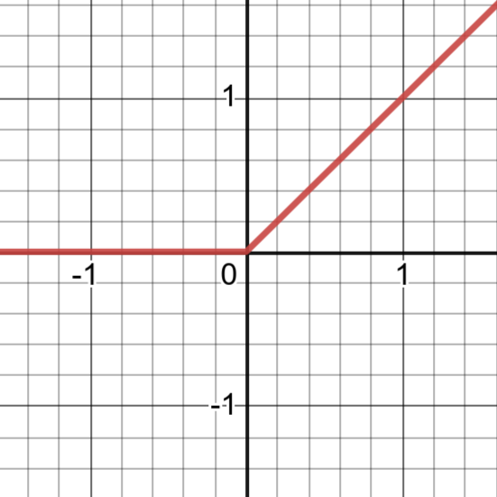
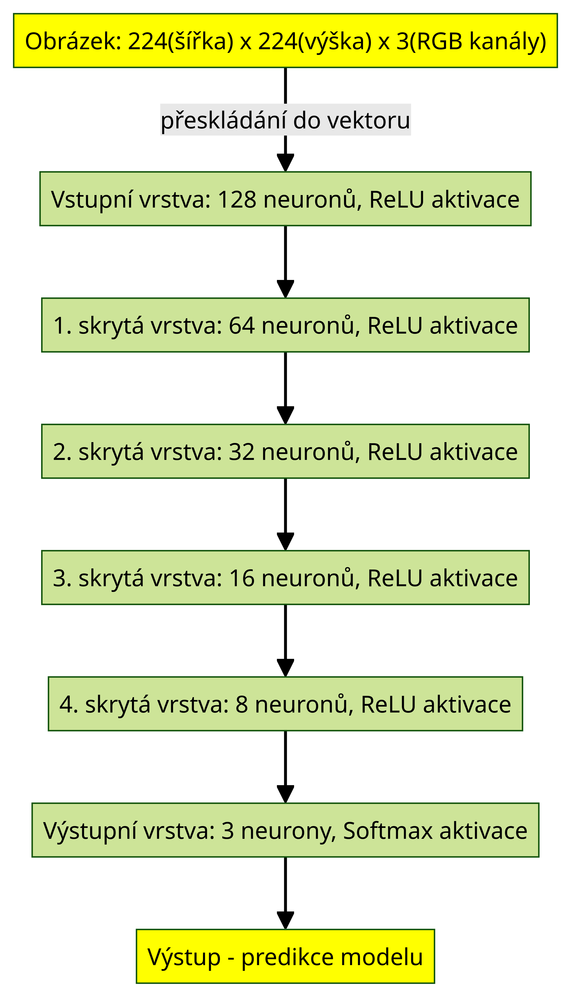
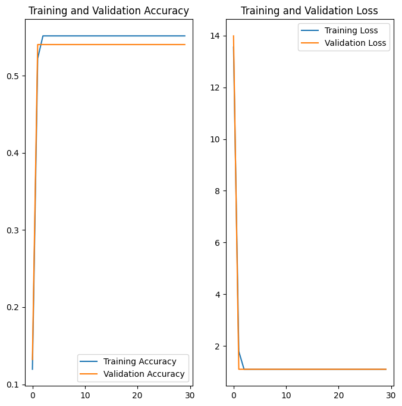

**Obor č. 18: Informační technologie**

**Použití neuronových sítí pro rozpoznávání tříděného odpadu z obrázků**
**Usage of neural networks in garbage classification from images**

**Autoři:** Adam Belej
** Škola:** Gymnázium, Šternberk, Horní náměstí 5, Šternberk
**Kraj:** Olomoucký
**Konzultant:** 

Šternberk 2023

***

**Prohlášení**
Prohlašuji, že jsem svou práci SOČ vypracoval samostatně a použil jsem pouze prameny
a literaturu uvedené v seznamu bibliografických záznamů.
Prohlašuji, že tištěná verze a elektronická verze soutěžní práce SOČ jsou shodné.
Nemám závažný důvod proti zpřístupňování této práce v souladu se zákonem č. 121/2000 Sb.,
o právu autorském, o právech souvisejících s právem autorským a o změně některých zákonů
(autorský zákon) ve znění pozdějších předpisů.
Ve Šternberku dne  ………………………………………………
Adam Belej

**Poděkování**

***

**Anotace**

**Klíčová slova**

Neuronové sítě, Rozpoznávání obrázků, Počítačové vidění

**Annotation**

**Keywords**

Neural networks, Image recognition, Computer vision

***

Obsah

***

# 1 Úvod

# 2 Neuronové sítě

## 2.1 Neuronová síť

Neuronová síť je složena z mnoha jednotek - neuronů, které jsou mezi sebou
propojeny a komunikují mezi sebou. Využívají se v mnoha odvětvích k široké
škále úkonů, mezi nimi je například zpracování a porozumění přirozenému textu,
rozpoznávání obrázků nebo jejich částí (počítačové vidění - computer vision) či cílení reklamy
a obsahu ve virtuálním prostředí na základě analýzy zájmů uživatele.

Je mnoho způsobů, jak tyto sítě implementovat v programu. Jednou z možností je
od základů naprogramovat neuronové sítě včetně chybové funkce a učení, častější
volbou je však některá z mnoha knihoven, které nabízí již optimalizované
a uživatelsky přívětivější navrhování architektury, přípravu a manipulaci
s daty, trénink a následnou evaluaci výsledků sítě. Mezi některé knihovny patří
například [TensorFlow](https://www.tensorflow.org/),
[PyTorch](https://pytorch.org/), [Caffe](http://caffe.berkeleyvision.org/)
v jazyce Python, v jazyce Java se dá použít knihovna
[Deeplearning4j](https://deeplearning4j.konduit.ai/). Pro svou práci jsem
zvolil knihovnu TensorFlow, jelikož je velice dobře zdokumentovaná, má širokou
škálu možností trénování a navrhování neuronových sítí, a také umožňuje velmi
jednoduše vizualizovat proces trénování a následnou úspěšnost.

V dnešní době je již hluboké učení na vysoké úrovni. Aktuálně dosahují
nejlepších výsledků při rozpoznávání obrázků a zpracování přirozeného jazyka
transformátory [^1], jejichž použití je v amatérském prostředí velmi výpočetně
a časově náročné. Proto jsme se rozhodli použít primárně konvoluční neuronové
sítě (CNN), které jsou výrazně méně výpočetně
náročné, a které dosahují taktéž velmi kvalitních výsledků u rozpoznávání
obrázků.

### 2.1.1 Vstupní data

Vzhledem k tomu, že k natrénování neuronové sítě dosahující přijatelných
výsledků je potřeba obrovské množství dat, bylo nutné vytvořit co možná
největší dataset fotografií tříděného odpadu ve všech třech kategoriích. Jedna
z možností byla stáhnout již existující dataset z některého z internetových
zdrojů (např. [Kaggle](https://www.kaggle.com/)), žádný z nich však nebyl
v tak vysoké kvalitě, o jakou jsme se pokoušeli, obrázky byly často velmi nízkého rozlišení, jejich obsah výrazně rozmazaný nebo i pro lidské oko často špatně rozpoznatelný.
Další možností bylo vytvořit dataset z obrázků nalezených na internetu, tahle
možnost však měla opět nevýhodu rozdílné kvality a navíc byla oproti
první možnosti časově náročnější s nepatrným zlepšením kvality výsledného
datasetu. Proto jsme zvolili třetí variantu, kterou bylo vytvoření úplně nového
vlastního datasetu. Tato možnost byla sice zdaleka časově nejnáročnější, ale
výsledné obrázky mají všechny stejnou velikost, rozměry a kvalitu. Všechny
fotky byly foceny na pozadí, které bylo vytvořeno z papíru a grafitu, a které
napodobuje pohybující se pás na třídící lince.

### 2.1.2 Zpracování a tvorba dat

Bylo nutné sjednotit formát dat, aby bylo možné je použít jako vstup pro
neuronové sítě. Zároveň jsme zvolili poměr stran 1:1, aby byla jednodušší
následná augmentace. Jelikož se jedná o velký objem dat, bylo potřeba
zautomatizovat celý proces přeformátování fotek na velikost 512x512 pixelů,
která by měla dostatečně zachovat objekty na fotkách, ale zároveň nebýt tak
velká, aby velikost dat výrazně neztížila proces trénování sítí. K tomuto jsme
nejprve použili knihovnu [Katna](https://pypi.org/project/katna/), která
s využitím umělé inteligence hledá důležitou část obrázku tak, aby při
ořezávání došlo k co možná nejmenší ztrátě dat. S její pomocí jsme obrázky
přeformátovali na poměr stran 1:1. Dále jsme využili knihovny
[Pillow](https://pypi.org/project/Pillow/) ke konverzi do formátu png
a zmenšení obrázků na jednotný formát 224x224 pixelů.

### 2.1.3 Datová augmentace
Datová augmentace je technika, při které se původní dataset rozšíří tím, že se
mírně poupraví nebo pozmění původní data a následně se přidají k původním
datům. 

K augmentaci obrázků, které již byly v požadovaném formátu jsem použil opět
knihovnu [Pillow](https://pypi.org/project/Pillow/). Všechny obrázky byly
nejdříve horizontálně převráceny, a pak otočeny o 90, 180 a 270°. Tímto
způsobem jsem efektivně zosminádobil vstupní data pro trénování.

Celý proces od přeformátování až po augmentaci je zautomatizován v programu
'dataset-creator.py', který je dostupný ve veřejném
[repozitáři](https://github.com/Adam-Belej/Garbage_classifier) na githubu,
který obsahuje všechen software vytvořen pro účely této práce. Tento program je
spustitelný z příkazového řádku, a jako vstupní parametry přijímá:

- šířku `-W` nebo `--width` (integer),
- výšku `-H` nebo `--height` (integer),
- cestu ke složce se vstupními soubory `-i` nebo `--input_dir` (string),
- cestu, kam následně uložit upravené fotky `-o` nebo `--output_dir` (string),
- formát, ve kterém budou fotky uloženy `-e` nebo `--extension` (string),
- zda augmentovat data, nebo je jen konvertovat na požadovanou velikost `-a` nebo
  `--augmentation` (bool)

Program byl vytvořen tak, aby byl co nejvíce generalizován, a díky tomu je dále
široce využitelný pro tvorbu dalších datasetů z obrázků.

### 2.1.1 Neuron

Neuron je základní jednotkou počítačových neuronových sítí, a jeho jádrem je
algoritmus, který pro matici vstupních dat $x$ o délce $k$ spočítá skalární
součin s vektorem váh (weights) $w$ a přičte k nim práh (bias) $b$, a následně
na toto číslo použije aktivační funkci $g$. Aktivační funkce má za cíl nelineárně transformovat výstup neuronu. Vzorcem lze tento proces vyjářit takto:
$f(x) = \sum_{i=1}^k w_i  x_i + b$ Mezi nejčastěji používané aktivační
funkce patří:

- logistická sigmoida $g(z) = \frac{1}{1 + e^{-z}}$ (obr. ), 
- hyperbolický tangens $g(z) = tanh(z)$ (obr. ),
- ReLU (Rectified Linear Unit)[^10] $g(z) = max(0, z)$ (obr. ), 
- softmax $g(z_i) = \frac{e^{z_{i}}}{\sum_{j=1}^K e^{z_{j}}}$ - tato aktivační
  funkce transformuje číselné hodnoty na pravděpodobnostní hodnotu, $K$ je počet
  kategorií. Býva používána zpravidla v poslední (výstupní) vrstvě u modelů
  s klasifikací do více kategorií, kde $K$ je počet kategorií do kterých model
  vstup klasifikuje. [^11]
  
  
   

### 2.1.2 Dopředná neuronová síť

Dopředná neuronová síť, se skládá z několika vrstev neuronů, které jsou na sebe napojeny. První (vstupní) vrstva dostává jako vstup přímo původní vstupní data, další (skryté) vrstvy pak výstupy z předchozích vrstev. Poslední (výstupní) vrstva mívá zpravidla u klasifikace
do více kategorií tolik neuronů, kolik je kategorií.  

### 2.1.3 Učení neuronové sítě

Pro učení neuronových sítí se používá algoritmus zpětného šíření chyby (anglicky error back propagation). Tento algoritmus pro každý trénovací vstup zjistí chybu - odchylku od správného výsledku metodou MSE (Mean Squared Error - Střední kvadratická chyba), kde odečte výstup daného neuronu od požadovaného správného výstupu, a tento rozdíl umocní. Následně pomocí parciální derivace zjistí podíl dané váhy neuronu na této chybě, a od této váhy odečte součin této parciální derivace s $\alpha$, kde $\alpha$ je parametr učení. [^12] Tuto operaci provádíme postupně od výstupní vrstvy až po vstupní vrstvu.

### 2.1.4 Husté neuronové sítě

Husté neuronové sítě jsou jedním z druhů sítí, kde každý neuron v dané vrstvě
dostává jako vstup celý vstupní vektor z předchozí vrstvy (v případě první
vrstvy vstup od uživatele), a pro vstupní vektor o délce $k$ má $k + 1$
parametrů (váhy pro každé $x_i$ a práh), a vstup pro n+1 vrstvu je vektor
výstupů n-té vrstvy o délce $l$, kde $l$ je počet neuronů  n-té vrstvy. Tento
druh sítí je pro účely rozpoznávání obrázků silně neefektivní. O tom jsme se přesvědčili tím, že jsme takovou síť zkusili sami natrénovat. Její architektura je na obrázku ____. I takto jednoduchá síť má obrovské množství parametrů - v našem případě 19278739. I přes velký počet parametrů však při trénování dosahovala velmi nedostatečných výsledků. Graf výsledků trénování je na obrázku ____. Při následném testování dosáhla přesnosti pouhých 0.5504, což je v praxi nepoužitelné.

### 2.1.5 Konvoluční neuronové sítě v teorii

Konvoluční neuronové sítě (CNN - Convoltional Neural Networks) jsou dalším, již pokročilejším druhem neuronových sítí. Využívají dvou operací - konvoluce a maxpoolingu. Konvoluční vrstva narozdíl od husté vrstvy využívá sdílených parametrů. 

# 3 Závěr

# Zdroje
[^1]: Understanding Transformer Neural Network Model in Deep Learning and NLP [online]. ©2023 [cit. 2023-12-16]. Dostupné z: https://www.turing.com/kb/brief-introduction-to-transformers-and-their-power
[^10]: A Gentle Introduction to the Rectified Linear Unit (ReLU) [online]. 2020 [cit. 2023-12-15]. Dostupné z: https://machinelearningmastery.com/rectified-linear-activation-function-for-deep-learning-neural-networks/
[^11]: Softmax Function Definition [online]. 2019 [cit. 2023-12-15]. Dostupné z: https://deepai.org/machine-learning-glossary-and-terms/softmax-layer
[^12]:  Neuronové sítě - úvod [online]. [cit. 2023-12-16]. Dostupné z: http://ktiml.mff.cuni.cz/~pilat/cs/prirodou-inspirovane-algoritmy/neuronove-site-uvod/