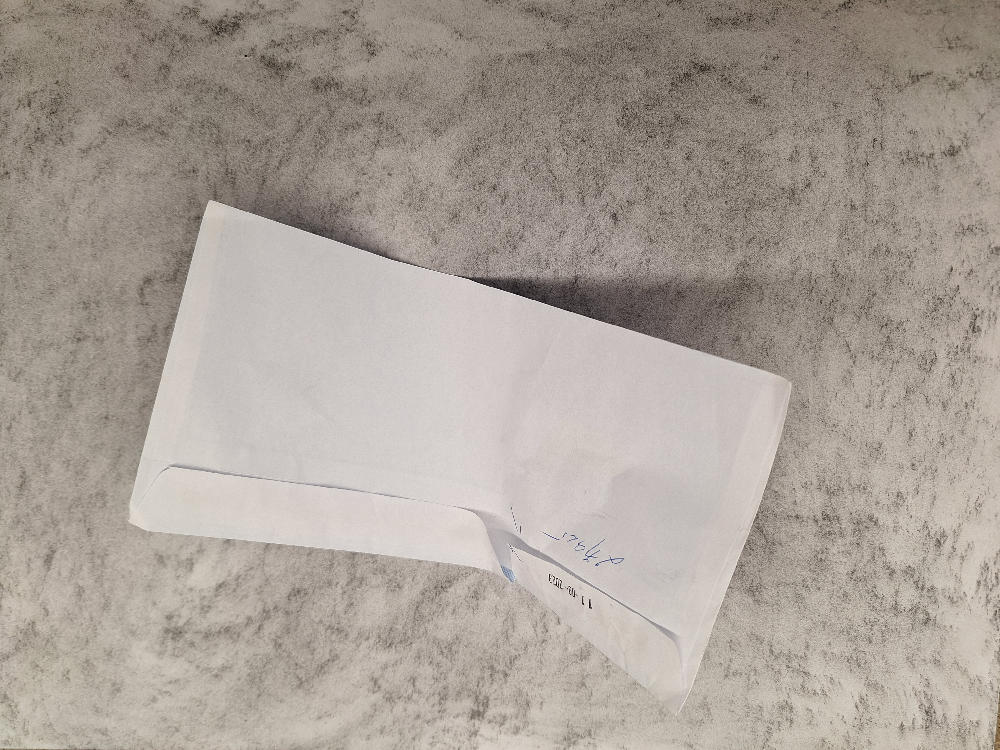
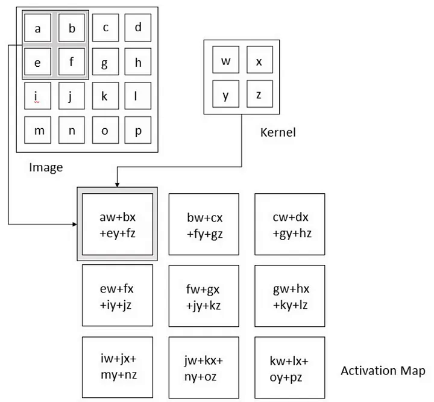
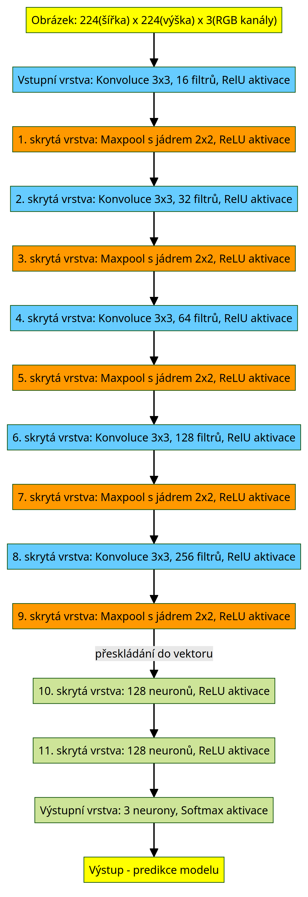
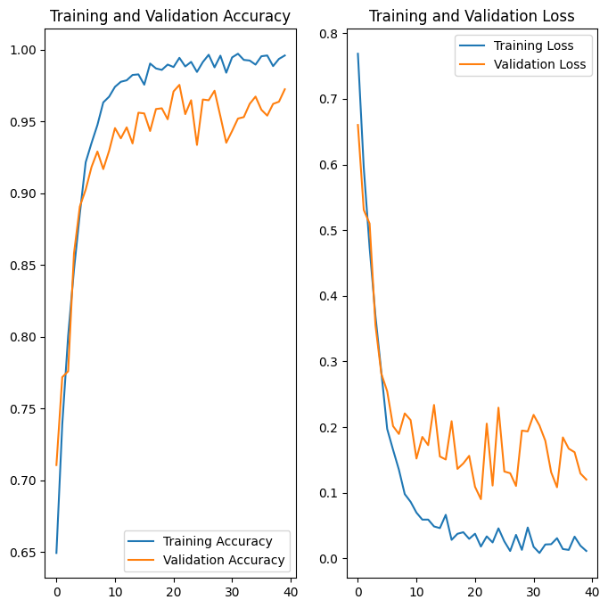
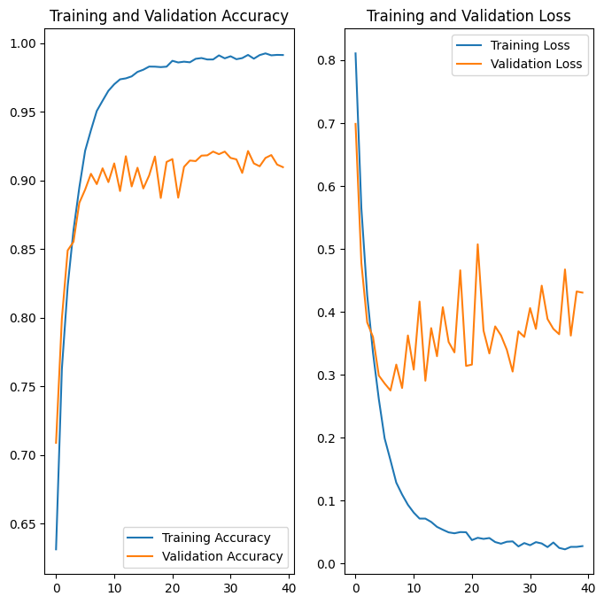

**Obor č. 18: Informační technologie**

**Využití konvolučních neuronových sítí pro rozpoznávání tříděného odpadu z obrázků**
**Usage of neural networks in garbage classification from images**

**Autoři:** Adam Belej
** Škola:** Gymnázium, Šternberk, Horní náměstí 5, Šternberk
**Kraj:** Olomoucký
**Konzultant:** 

Šternberk 2023

***

**Prohlášení**
Prohlašuji, že jsem svou práci SOČ vypracoval samostatně a použil jsem pouze prameny
a literaturu uvedené v seznamu bibliografických záznamů.
Prohlašuji, že tištěná verze a elektronická verze soutěžní práce SOČ jsou shodné.
Nemám závažný důvod proti zpřístupňování této práce v souladu se zákonem č. 121/2000 Sb.,
o právu autorském, o právech souvisejících s právem autorským a o změně některých zákonů
(autorský zákon) ve znění pozdějších předpisů.
Ve Šternberku dne  ………………………………………………
Adam Belej

**Poděkování**

***

**Anotace**

Práce popisuje vývoj modelu konvoluční neuronové sítě, jež má za cíl rozpoznávat z obrázků tříděný odpad ve třech kategoriích. Nejdříve je zdokumentován postupně počáteční sběr dat, a jsou zjednodušeně zadefinovány základní teoretické koncepty na kterých konvoluční neuronové sítě staví. Dále pak popisujeme, jak jsme se snažili vyvinout co nejefektivnější model a proces tréninku několika modelů a jejich úspěšnost.

**Klíčová slova**

Konvoluční neuronové sítě, strojové učení, rozpoznávání obrázků, počítačové vidění, umělá inteligence

**Annotation**

The thesis describes the development of a convolutional neural network, whose aim is to recognize sorted waste in three categories from images. Firstly, it documents the inital data collection and defines the basic theoretical concepts, on which convolutional neural networks are based. Then we describe how we tried to develop an effective model and the process of training several models and their success rates.

**Keywords**

Convolutional neural networks, machine learning, image recognition, computer vision, artificial intelligence

***

Obsah

***

# 1 Úvod

V dnešní době se čím dál častěji ve veřejném prostoru objevují slovní spojení "Umělá inteligence" a "Strojové učení", a také začínají být velmi rozšířené modely jako například ChatGPT[^v] pro generování textu či Leonardo[^y] pro generování obrázků podle textového řetězce, které stavějí právě na konceptech strojového učení. Tyto modely jsou velmi složité, a proto se nebudeme věnovat přímo jim, ale prvním cílem práce je seznámit alespoň intuitivně čtenáře se základními koncepty neuronových sítí, které jsou důležitou součástí strojového učení, specifičtěji se pak věnujeme využití konvolučních neuronových sítí pro rozpoznávání a klasifikaci obrázků (Počítačové vidění - Computer vision). 
Dalším cílem práce je demonstrovat tyto koncepty prakticky, a to vytvořením a natrénováním modelu, který bude schopen s co největší úspěšností klasifikovat obrázky do tří kategorií - plast, papír a sklo. Celý proces je popsán od počátečního sběru dat a vytvoření datasetu s jednotnými parametry přes trénování modelu až po vyhodnocování úspěšnosti a pokusů o zlepšení úspěšnosti testováním různých parametrů učení a architektur. Motivací pro výběr právě rozpoznávání tříděného odpadu byla zodpovědnost k životnímu prostředí, kde by zautomatizování a implementování procesu rozřazování na třídících linkách odpadohospodářských společností mohlo zvýšit množství odpadu, který bude zrecyklován, a naopak snížit množství odpadu, který je poslán do spaloven i přes to, že je stále recyklovatelný.

[^v]: ChatGPT: https://chat.openai.com/
[^y]: Leonardo: https://leonardo.ai/

# 2 Neuronové sítě

Neuronová síť je složena z mnoha jednotek - neuronů, které jsou mezi sebou
propojeny a komunikují mezi sebou. Využívají se v mnoha odvětvích k široké
škále úkonů, mezi nimi je například zpracování a porozumění přirozenému textu,
rozpoznávání obrázků nebo jejich částí (počítačové vidění - computer vision), rozpoznávání řeči[^o] (speech recognition) či cílení reklamy
a obsahu ve virtuálním prostředí na základě analýzy zájmů uživatele.

Je mnoho způsobů, jak tyto sítě implementovat v programu. Jednou z možností je
od základů naprogramovat neuronové sítě včetně chybové funkce a učení, častější
volbou je však některá z mnoha knihoven, které nabízí již optimalizované
a uživatelsky přívětivější navrhování architektury, přípravu a manipulaci
s daty, trénink a následnou evaluaci výsledků sítě. Mezi některé knihovny patří
například TensorFlow[^103], PyTorch[^104] a Caffe[^105] v jazyce Python, v jazyce Java se dá použít knihovna Deeplearning4j[^106]. Pro svou práci jsme zvolili knihovnu TensorFlow, jelikož je velice dobře zdokumentovaná, má širokou škálu možností trénování a navrhování neuronových sítí, a také umožňuje velmi jednoduše vizualizovat proces trénování a úspěšnost. Také se již natrénované modely dají jednoduše exportovat a následně použít na mobilních zařízeních bez nutnosti tak vysoké výpočetní kapacity, jaká je potřeba k trénování daných sítí.

V dnešní době je již hluboké učení na vysoké úrovni. Aktuálně nejlepších výsledků nejen při rozpoznávání obrázků a zpracování přirozeného jazyka dosahují  transformery[^1]. O tomto svědčí i skutečnost, že v letošním roce dosáhl nejlepších výsledků pro rozpoznávání obrázků na datasetu ImageNet model OmniVec[^a], jež v jádru využívá právě transformerů.  Jejichž použití je však v amatérském prostředí velmi výpočetně
a časově náročné. Proto jsme se rozhodli použít primárně konvoluční neuronové sítě (CNN), které jsou výrazně méně výpočetně náročné, a které dosahují taktéž velmi kvalitních výsledků u rozpoznávání
obrázků.

[^103]: TensorFlow: https://www.tensorflow.org/
[^104]: PyTorch: https://pytorch.org/
[^105]: Caffe: http://caffe.berkeleyvision.org/
[^106]: Deeplearning4j: https://deeplearning4j.konduit.ai/

## 2.1 Vstupní data

Vzhledem k tomu, že k natrénování neuronové sítě dosahující přijatelných
výsledků je potřeba obrovské množství dat, bylo nutné vytvořit co možná
největší dataset fotografií tříděného odpadu ve všech třech kategoriích (papír, plast a sklo). Jedna
z možností byla použít již existující dataset z některého z dostupných
zdrojů (např. Kaggle[^100]), žádný z nich však nebyl
v tak vysoké kvalitě, o jakou jsme se pokoušeli, obrázky byly často velmi nízkého rozlišení, jejich obsah výrazně rozmazaný nebo i pro lidské oko často špatně rozpoznatelný a odpadky byly často pořizovány z velice rozdílých úhlů a vzdáleností.
Další možností bylo vytvořit dataset z obrázků nalezených na internetu, tahle
možnost však měla opět nevýhodu rozdílné kvality a navíc byla oproti
první možnosti časově náročnější s nepatrným zlepšením kvality výsledného
datasetu. Proto jsme zvolili třetí variantu, kterou bylo vytvoření úplně nového
vlastního datasetu. Tato možnost byla sice zdaleka časově nejnáročnější, ale
výsledné obrázky mají všechny stejnou velikost, rozměry a kvalitu. Všechny
fotky byly foceny na pozadí, které bylo vytvořeno z papíru a grafitu, a které
napodobuje pohybující se pás na třídící lince.

[^100]: Kaggle: www.kaggle.com

### 2.1.1 Zpracování a tvorba dat

Bylo nutné sjednotit formát dat, aby bylo možné je použít jako vstup pro
neuronovou síť. Zároveň jsme zvolili poměr stran 1:1, aby byla jednodušší
následná augmentace. Jelikož se jedná o velký objem dat, bylo potřeba
zautomatizovat celý proces přeformátování fotek na velikost 224x224 pixelů - tato velikost bývá často používána při rozpoznávání obrázků, pracuje s ní například AlexNet[^x] -
která by měla dostatečně zachovat objekty na fotkách, ale zároveň nebýt tak
velká, aby velikost dat výrazně neztížila proces trénování sítí. K tomuto jsme
nejprve použili knihovnu Katna[^101], která
s využitím umělé inteligence hledá důležitou část obrázku tak, aby při
ořezávání došlo k co možná nejmenší ztrátě dat. S její pomocí jsme obrázky
přeformátovali na poměr stran 1:1. Dále jsme využili knihovny
Pillow[^102] ke konverzi do formátu png
a zmenšení obrázků na jednotný formát 224x224 pixelů.

[^101]: Katna: https://katna.readthedocs.io
[^102]: Pillow: https://pillow.readthedocs.io

### 2.1.2 Datová augmentace

Datová augmentace je technika, při které se původní dataset rozšíří tím, že se
mírně poupraví nebo pozmění původní data a následně se přidají k původním
datům. 

K augmentaci obrázků, které již byly v požadovaném formátu jsme použili opět
knihovnu Pillow[^102]. Všechny obrázky byly
nejdříve horizontálně převráceny, a pak otočeny o 90, 180 a 270°. Tímto
způsobem jsme efektivně zosminádobili vstupní data pro trénování.

Celý proces od přeformátování až po augmentaci je zautomatizován v programu
'dataset-creator.py', který je dostupný ve veřejném
[repozitáři](https://github.com/Adam-Belej/Garbage_classifier) na githubu,
který obsahuje všechen software vytvořen pro účely této práce. Tento program je
spustitelný z příkazového řádku, a jako vstupní parametry přijímá:

- šířku `-W` nebo `--width` (integer),
- výšku `-H` nebo `--height` (integer),
- cestu ke složce se vstupními soubory `-i` nebo `--input_dir` (string),
- cestu, kam následně uložit upravené fotky `-o` nebo `--output_dir` (string),
- formát, ve kterém budou fotky uloženy `-e` nebo `--extension` (string),
- zda augmentovat data, nebo je jen konvertovat na požadovanou velikost `-a` nebo
  `--augmentation` (bool)

Program byl vytvořen tak, aby byl co nejvíce generalizován, a díky tomu je dále
široce využitelný pro tvorbu dalších datasetů z obrázků.

[^102]: Pillow: https://pillow.readthedocs.io

# 2.2 Neuronové sítě v teorii

### 2.2.1 Neuron

Neuron je základní jednotkou počítačových neuronových sítí, a jeho jádrem je
algoritmus, který pro matici vstupních dat $x$ o délce $k$ spočítá skalární
součin s vektorem vah (weights) $w$ a přičte k nim práh (bias) $b$, a následně
na tuto hodnotu aplikuje aktivační funkci $g$. Aktivační funkce má za cíl nelineárně transformovat výstup neuronu, bez ní by bylo kontraproduktivní používat více neruronů, jelikož by se jednalo stále o tu samou lineární funkci. Vzorcem lze tento proces vyjářit takto:
$f(x) = \sum_{i=1}^k w_i  x_i + b$ Mezi nejčastěji používané aktivační
funkce patří:

- logistická sigmoida $g(z) = \frac{1}{1 + e^{-z}}$ (obr. ), 
- hyperbolický tangens $g(z) = tanh(z)$ (obr. ),
- ReLU (Rectified Linear Unit)[^2] $g(z) = max(0, z)$ (obr. ), 
- softmax $g(z_i) = \frac{e^{z_{i}}}{\sum_{j=1}^K e^{z_{j}}}$ - tato aktivační
  funkce transformuje číselné hodnoty na pravděpodobnostní hodnotu, $K$ je počet
  kategorií. Býva používána zpravidla v poslední (výstupní) vrstvě u modelů
  s klasifikací do více kategorií, kde $K$ je počet kategorií do kterých model
  vstup klasifikuje. [^3]
  
  
   

### 2.2.2 Dopředná neuronová síť

Dopředná neuronová síť se skládá z několika vrstev neuronů, které jsou na sebe napojeny. První (vstupní) vrstva dostává jako vstup přímo původní vstupní data, další (skryté) vrstvy pak výstupy z předchozích vrstev. Poslední (výstupní) vrstva mívá zpravidla u klasifikace
do více kategorií tolik neuronů, kolik je kategorií.  

### 2.2.3 Učení neuronové sítě

Pro učení neuronových sítí se používá algoritmus zpětného šíření chyby (anglicky error back propagation). Tento algoritmus pro každý trénovací vstup zjistí chybu - odchylku od správného výsledku metodou MSE (Mean Squared Error - Střední kvadratická chyba), kde odečte výstup daného neuronu od požadovaného správného výstupu, a tento rozdíl umocní. Následně pomocí parciální derivace zjistí, jak velký podíl má tento neuron na chybném výstupu, a od této váhy odečte součin této parciální derivace s $\alpha$[^12], kde $\alpha$ je parametr učení.  Tuto operaci provádíme postupně od výstupní vrstvy až po vstupní vrstvu. Takto se projde každý tréninkový vstup. Proces, při kterém model jednou projde celý tréninkový dataset se nazývá epocha.

Při učení jednotlivých modelů je možné se poměrně často setkat s fenoménem přeučení[^h], kdy se model příliš přizpůsobí datům, na kterých jej učíme - například se místo rozpoznávání objektů na obrázku naučí rozpoznávat nepatrný šum v pozadí jednotlivých obrázků. Pro tato data pak vykazuje velmi vysokou úspěšnost klasifikace, na nových - pro model neznámých - datech však dosahuje výrazně horších výsledků. Mezi některé možné příčiny tohoto problému patří nedostatek tréninkových dat, přílišný šum obrázků a přílišná kapacita modelu. Typicky se dá tento problém vyřešit navýšením objemu tréninkových dat nebo mírným zjednodušením modelu odebráním některé z vrstev. snížením počtu neuronů v některých vrstvách nebo zastavení učení po nižším počtu epoch.

Opačným jevem je podučení, které je dnes již vzhledem ke složitosti používaných modelů méně častým jevem, ale stále je možné se s ním setkat. Tento jev bývá nejčastěji způsoben přílišnou jednoduchostí modelu, a tak zpravidla bývá řešením navýšení kapacity modelu.

### 2.2.4 Vyhodnocování úspěšnosti modelu

Po natrénování modelu na tréninkových datech je naším cílem zjistit jak dobře model funguje. To můžeme zjistit tak, že jej necháme klasifikovat data, a spočítáme, v kolika procentech případů zařadí model vstupy správně. Mohli bychom zjistit, v kolika procentech správně zařadí tréninková data, ale v takovém případě by výsledek byl zavádějící, jelikož jsou to právě data, na kterých se učil, a tak s vysokou pravděpodobností bude mít při dobře navržené architektuře sítě velmi dobrou úspěšnost na těchto datech. Většinou je však cílem trénování modelu naučit jej rozpoznávat nová - pro model neznámá data. Proto původní dataset rozdělíme, a 90% dat použijeme na učení, a zbylých 10% necháme na pozdější otestování úspěšnosti rozpoznávání nových dat. Z tréninkových 90% dále použijeme část na validaci, která vždy na konci epochy zkontroluje, zda náš model není přeučený a mírně poupraví parametry.

### 2.2.5 Husté neuronové sítě

Husté neuronové sítě jsou jedním z nejjednodušších druhů sítí, kde každý neuron v dané vrstvě dostává jako vstup celý vstupní vektor z předchozí vrstvy (v případě první vrstvy vstup od uživatele), a pro vstupní vektor o délce $k$ má $k + 1$ parametrů (váhy pro každé $x_i$ a práh), a vstup pro n+1 vrstvu je vektor výstupů n-té vrstvy o délce $l$, kde $l$ je počet neuronů  n-té vrstvy. Tento druh sítí však nemá pro účely rozpoznávání obrázků požadovanou přesnost. O tom jsme se přesvědčili tím, že jsme takovou síť zkusili sami natrénovat. Její architektura je na obrázku 3. I takto jednoduchá síť má obrovské množství parametrů - v našem případě téměř 20 milionů. I přes velký počet parametrů však při trénování dosahovala velmi nedostatečných výsledků. Graf výsledků trénování je na obrázku 4. Při následném testování dosáhla přesnosti pouhých 0.5504, což je pro praktické využití velmi nedostatečný výsledek.

# 3 Konvoluční neuronové sítě

## 3.1 Konvoluční neuronové sítě - teorie

Konvoluční neuronové sítě (CNN - Convolutional Neural Networks)[^p] jsou dalším, již pokročilejším druhem neuronových sítí. Tento druh sítí v minulosti vykazoval při rozpoznávání obrázků výrazně lepších výsledků než husté sítě. [^5] U konvolučních neuronových sítí se využívá dvou dalších operací oproti hustým sítím - konvoluce a poolingu. 

### 3.1.1 Konvoluce

Konvoluce je operace, při níž se na původní obrázek použijí tzv. jádra (kernely) konvoluce neboli filtry - matice o předem určených rozměrech, které jsou vždy přiloženy k části původního obrázku, a následně je spočítán skalární součet s danou oblastí obrázku (obr ____[^6]). Tato operace se nejprve aplikuje na levý horní roh obrázku, a dále se jádro posouvá nejprve doprava, a následně níže o krok (anglicky stride) - vektor dvou čísel (krok doprava a krok dolů), v našem případě (1, 1). Na výsledky konvoluce je použita aktivační funkce. Tato nově vzniklá hodnota je zapsána na příslušné místo do nové matice, která je vstupem následující vrstvy. U konvoluce dochází k ztrácení hodnot pixelů na okrajích obrázku, jelikož jsou při výpočtech využívány méněkrát než pixely dále od kraje. K vyřešení tohoto problému se využívá padding - operace, při které se přidají kolem okrajů obrázku nulové hodnoty tak, aby došlo ke snížení ztrát informací obsažených v okrajových pixelech.[^7]

### 3.1.2 Pooling

Další typ operace, jež se využívá u KNS je pooling. Tak jako u konvoluce se pooling aplikuje na každou část obrázku o specifikované velikosti. Pooling má za cíl dále redukovat komplexitu vstupu tím, že extrahuje z oblasti významné informace. Existuje například average pooling, který zprůměruje hodnoty oblasti, a tuto hodnotu zapíše do výsledného zmenšeného výstupu. Dále existuje max pooling, který narozdíl od average poolu vždy na výstup zapíše nejvyšší hodnotu oblasti. 

## 3.2 Konvoluční neuronové sítě - praktická část

Prvním krokem k vytvoření co možná nejlepšího modelu bylo potřeba nejprve navrhnout architekturu naší sítě. Při návrhu této architektury jsme vycházeli z AlexNetu[^x], částečně jsme se také inspirovali o něco starším a jednodušším LeNetem[^5]. Jako výchozí model jsme nakonec zvolili model na obrázku 6. 

Při učení o 40 epochách se nám povedlo dosáhnout testovací úspěšnosti 0.9321 na testovacím vzorku 4359 obrázků. Tento výsledek se zdál být velmi dobrý, ale přesto jsme chtěli zjistit, jak dobře tento model reaguje na data, která již nejsou na stejném pozadí, a proto jsme se rozhodli otestovat model na datech volně dostupných na platformě Kaggle. Na těchto datech již náš model dosahoval výrazně horších výsledků - úspěšnost klasifikace na vzorku 15840 dat byla 0.6355. Přestože tento model by byl v praxi při zachování podmínek (stejné pozadí) a dalším učení na rozsáhlejším datasetu pravděpodobně použitelný, rozhodli jsme se učit model na výrazně větším množství dat, abychom jej zobecnili. Tato data jsme získali spojením námi vytvořeného datasetu a dalšími volně dostupnými datasety z platformy Kaggle. Tímto způsobem jsme téměř ztrojnásobili původní množinu dat, a nový dataset byl výrazně obecnější - obsahoval obrázky na rozličných pozadích, v odlišných světelných podmínkách a také na ještě větším vzorku odpadků, jež se mohou v třech klasifikovaných kategoriích objevit. 

Dále jsme pokračovali v učení, pro každé nové učení jsme mírně poupravili některé parametry trénování - počet vrstev, počet epoch, batch size, parametr učení nebo přidali padding.
Dvě tabulky níže ukazují výsledky jednotlivých modelů, jedna na našich datech, druhá na rozšířeném datasetu, a obrázky pod nimi grafy průběhu trénování modelu s nejlepší testovací úspěšností pro každý z datasetů..

| Typ sítě | Vrstev | Batch size | Epoch | Parametr učení $\alpha$ | Padding | Tréninková úspěšnost | Testovací úspěšnost | Poznámka |
| ---- | ---- | ---- | ---- | ---- | ---- | ---- | ---- | --- |
|Hustá|6x plně propojená|128|30|0.001|Ne|0.5516|0.5504||
|Konvoluční|5x konvoluce, 5x  maxpool, 3x plně propojená|128|40|0.001|Ne|0.9960|**0.9321**||
|Konvoluční|6x konvoluce, 5x  maxpool, 3x plně propojená|256|40|0.0001|Ano, při první konvoluci|0.9404|0.8575|Zdvojená třetí konvoluce|
|Konvoluční|6x konvoluce, 5x  maxpool, 3x plně propojená|256|40|0.0001|Ne|0.9327|0.8674|Zdvojená třetí konvoluce|
|Konvoluční|6x konvoluce, 5x  maxpool, 3x plně propojená|256|60|0.0001|Ne|0.9643|0.8520|Zdvojená třetí konvoluce|
|Konvoluční|5x konvoluce, 5x  maxpool, 3x plně propojená|256|60|0.0001|Ne|0.9637|0.8724||
|Konvoluční|5x konvoluce, 5x  maxpool, 3x plně propojená|256|60|0.0002|Ne|**1.000**|0.9007||
|Konvoluční|5x konvoluce, 5x  maxpool, 3x plně propojená|512|60|0.0002|Ne|0.9520|0.8919||

*Tabulka 1: Výsledky trénování jednotlivých modelů na námi vytvořeném datasetu* 

| Typ sítě | Vrstev | Batch size | Epoch | Parametr učení $\alpha$ | Padding | Tréninková úspěšnost | Testovací úspěšnost | Poznámka |
| ---- | ---- | ---- | ---- | ---- | ---- | ---- | ---- | --- |
|Hustá|6x plně propojená|128|30|0.001|Ne|0.3277|0.3318||
|Konvoluční|5x konvoluce, 5x maxpool, 3x plně propojená|128|40|0.001|Ne|0.9914|**0.8483**||
|Konvoluční|5x konvoluce, 5x maxpool, 4x plně propojená|128|40|0.001|Ano, při první konvoluci|0.9034|0.8314||
|Konvoluční|5x konvoluce, 5x maxpool, 4x plně propojená|128|30|0.001|Ano, při první konvoluci|0.9895|0.8305||
|Konvoluční|6x konvoluce, 6x maxpool, 3x plně propojená|128|30|0.001|Ano, při první konvoluci|0.8953|0.8232||
|Konvoluční|6x konvoluce, 6x maxpool, 3x plně propojená|128|30|0.0001|Ano, při první konvoluci|0.9822|0.8185||
|Konvoluční|6x konvoluce, 6x maxpool, 3x plně propojená|128|60|0.0001|Ano, při první konvoluci|0.9043|0.8293||
|Konvoluční|6x konvoluce, 5x maxpool, 3x plně propojená|128|60|0.0001|Ano, při první konvoluci|**0.9916**|0.8093|Zdvojená třetí konvoluce|
|Konvoluční|6x konvoluce, 5x maxpool, 3x plně propojená|256|25|0.0001|Ano, při první konvoluci|0.8604|0.8097|Zdvojená třetí konvoluce|
|Konvoluční|6x konvoluce, 5x maxpool, 3x plně propojená|256|40|0.0001|Ano, při první konvoluci|0.9452|0.8168|Zdvojená třetí konvoluce|
|Konvoluční|5x konvoluce, 5x maxpool, 3x plně propojená|512|60|0.0002|Ne|0.9855|0.8405||

*Tabulka 2: Výsledky trénování jednotlivých modelů na datasetu rozšířeném o další obrázky z volně dostupných zdrojů* 

Dva obrázky níže ukazují proces trénování dvou modelů s nejlepšími výsledky na obou verzích datasetu.

# 4 Závěr

V této práci je nejdříve popsán sběr dat (obrázků) ve třech kategoriích - plast, papír a sklo - a jejich následné zpracování do podoby datasetu s jednotným fromátem, který je následně využitelný pro natrénování neuronové sítě. Dále jsou přiblíženy matematické koncepty na kterých staví neuronové sítě. Poté jsme se teoreticky věnovali konvolučním neuronovým sítím, a tuto teorii pak prakticky využili při trénování několika modelů s různýmí paramtery trénování. Také popisujeme některá úskalí, s nimiž se lze setkat při tréninku neuronových sítí, a se kterými jsme se také v některých případech setkali.

V rámci naší práce jsme vytvořili dataset, který je volně dostupný na adrese https://www.kaggle.com/datasets/ackobecko/odpadky, dále jsme vytvořili program, který dokáže ze složky obrázků udělat dataset specifikovaných parametrů, jako je výška, šířka, a také je dále augmentovat. Tento program byl vytvářen co nejobecněji, a tak je dále široce využitelný pro tvorbu dalších obrázkových datasetů. Dále jsme vytvořili několik modelů konvolučních neuronových sítí, z nichž dva s nejlepší úspěšností - jeden na pouze našem datasetu, druhý na datasetu rozšířeném o data z dostupných zdrojů na internetu - jsou volně dostupné na adrese https://github.com/Adam-Belej/Garbage_classifier, kde jsou zároveň zveřejněny ostatní části softwaru, včetně již zmíněného programu pro tvorbu datasetů. 

Dalšími kroky do budoucna je komunikace s odpadohospodářskými společnostmi o možnostech implementace těchto modelů v praxi na třídících linkách. Model trénovaný a testovaný pouze na našich datech, u nichž má pozadí připomínat právě hýbající se pás na třídící lince - dosahuje testovací úspěšnosti 0.9321, což stále v praxi znamená, že ze 100 exemplářů 7 špatně klasifikuje. Proto by bylo dalším smysluplným krokem při využití našeho modelu v praxi nasbírat ještě výrazně více dat, na kterých bychom model znovu natrénovali, případně ještě dále doupravili a optimalizovali jednotlivé parametry trénování. Druhý model, který je obecnější, a který dosahuje nižší úspěšnosti - 0.8483 - je sice méně přesný, ale stále se jedná o vcelku dobrý výsledek, vezmeme-li v potaz fakt, že dat bylo poměrně málo a byla velmi různorodá, což je pro model mnohem náročnější na naučení. Tento model sice není v praxi použitelný, avšak na něm lze ukázat, že i přes nedostatečné množství dat vzhledem ke složitosti obrázků je schopen dosáhnout vcelku dobré úspěšnosti. 

# Zdroje

[^o]: NASSIF, Ali Bou , Ismail SHANIN, Imtinan ATTILI, Mohammad AZZEH and Khaled SHAALAN. *Speech Recognition Using Deep Neural Networks: A Systematic Review*. 2019.
[^1]: VASWANI, Ashish, Noam SHAZEER, Niki PARMAR, Jakob USZKOREIT, Llion JONES, Lukasz KAISER, Illia POLOSUKHIN a Aidan N. GOMEZ. *Attention is all you need*. 2017.
[^a]:  SRIVASTAVA S., G. SHARMA. *OmniVec: Learning robust representations with cross modal sharing*. 2023. 
[^2]: AGARAP Abien F. *Deep Learning using Rectified Linear Units (ReLU)*. 2018.
[^3]: LIU Weiyang, Yandong WEN, Zhiding YU a meng YANG. *Large-Margin Softmax Loss for Convolutional Neural Networks*. 2016.
[^12]:  Neuronové sítě - úvod [online]. [cit. 2023-12-16]. Dostupné z: http://ktiml.mff.cuni.cz/~pilat/cs/prirodou-inspirovane-algoritmy/neuronove-site-uvod/
[^h]: SALMAN Shaeke, LIU Xiuwen.* Overfitting Mechanism and Avoidance in Deep Neural Networks*. 2019.
[^5]: LECUN Yann et al. *Gradient-based learning applied to document recognition*. Proceedings of the IEEE, v. 86, pp. 2278-2324, 1998.
[^p]: LECUN Yann et al. *Backpropagation Applied to Handwritten Zip Code Recognition*. 1989.
[^6]: GOODFELLOW, Ian, Yoshua BENGIO a Aaron COURVILLE. *The Convolution Operation*. In: Deep Learning [online]. 2016 [cit. 2023-12-17]. Dostupné z: deeplearningbook.org
[^7]: ZHANG, Aston, Zachary C. LIPTON,  Mu  LI,  a Alexander J. SMOLA. *Dive into Deep Learning* [online]. Cambridge University Press, 2023 [cit. 2023-12-17]. Dostupné z: https://d2l.ai/chapter_convolutional-neural-networks/padding-and-strides.html
[^x]: KRIZHEVSKY Alex et al. *ImageNet Classification with Deep Convolutional Neural Networks*. 2012.
